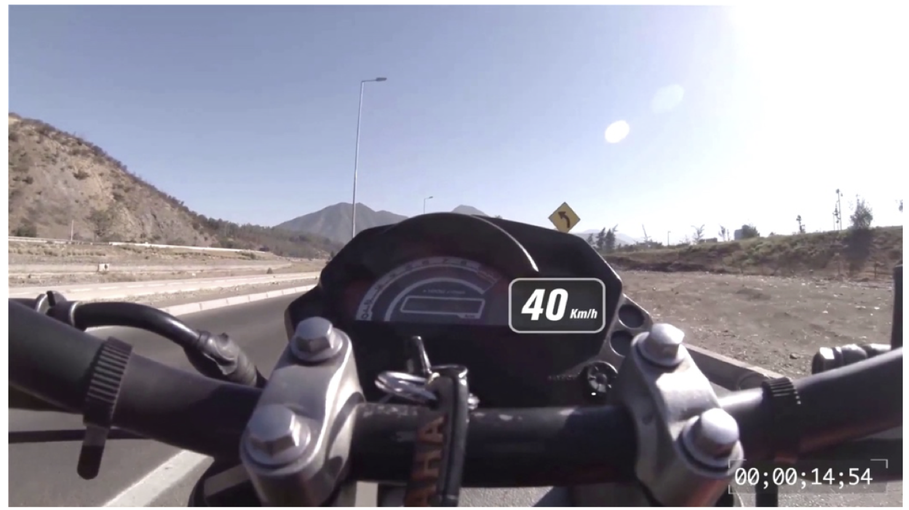
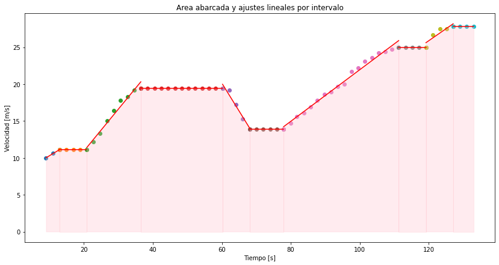
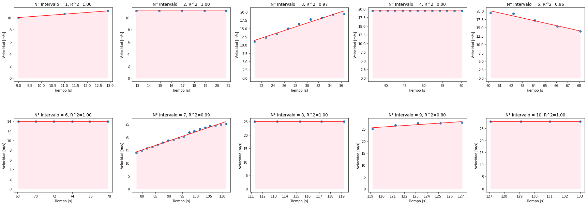
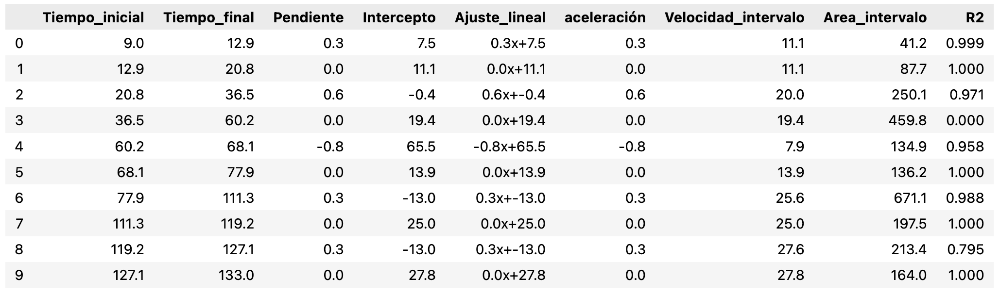

<div align="center">
  
# ESTUDIO DEL MOVIMIENTO EN DOS DIMENSIONES: ANÁLISIS DE GRÁFICOS USANDO PYTHON
<p>
  
</p>

</div>

## Resumen

Este proyecto se centra en el analisis del registro audiovisual experimental, el cual presenta la velocidad y tiempo instantáneo de un motociclista miemtras circula por una carretera. El proceso se realiza mediante la **captura automatizada de cuadros** cada dos segundos, en un rango de 9 [s] a 133 [s] (ambos inclusive), utilizando Python en Visual Studio Code, mientras que el estudio se lleva a cabo dividiendo los datos en diez intervalos de tiempo, realizando ajustes lineales mediante el método de los mínimos cuadrados, calculando la velocidad media para cada intervalo, y aproximando el área bajo la curva utilizando el método de los trapecios mediante la función `trapz`. Los resultados indican un recorrido total de 2355.9 metros, con un patrón cíclico de un intervalo de tiempo por medio, en el que su aceleración pasaba de ser aproximadamente constante, a cero.

## Tecnologías Utilizadas

- **Python**
- **Visual Studio Code**
- **Bibliotecas de Python**: `Matplotlib`, `Numpy`, `Pandas`, `SciPy`, `Scikit-learn`
- **GitHub Repository**: [2DMotion_NLQ](https://github.com/Nicole-lq/2DMotion_NLQ)

## Instrucciones para Clonar el Repositorio

1. Clonar el repositorio desde GitHub:

```bash
git clone https://github.com/Nicole-lq/2DMotion_NLQ.git
```
2. Navegar al directorio del proyecto:

```bash
cd 2DMotion_NLQ
```

3. Abrir el proyecto en Visual Studio Code
   

## Métodos de Análisis

El análisis de gráficos incluye:

* Gráficos de dispersión de los datos de velocidad y tiempo.
* Ajuste lineal por intervalos utilizando el método de los mínimos cuadrados.
* Cálculo de áreas bajo la curva con el método del trapecio utilizando la función trapz.

## Visualizaciones

Se presentan algunas de las gráficas obtenidas, así como la tabla final de los datos obtenidos. Para mayor detalle se suguiere revisar el informe y/o el código presentado.

<div align="center">
  
### Gráfico 1: Velocidad versus tiempo con regresiones lineales por tramo y área total
<p>
  
</p>
</p>
  
### Gráfico 2: Velocidad versus tiempo por tramo con áreas y R²
<p>
  
</p>
</p>
  
### Tabla: Síntesis final de los resultados por tramo
<p>
  
</p>
</p>

</div>

## Resultados Principales

* El motociclista recorrió un total de 2355.9 metros.
* Se observó un patrón cíclico de aceleración, donde en un intervalo la aceleración es constante, mientras que en el siguiente la aceleración es cero.

## Conclusiones

Los gráficos son herramientas esenciales para el análisis de datos en física, requiriendo una confección e interpretación adecuadas. A pesar de que la gráfica general no obedecía a un MRUA, los ajustes lineales permitieron aproximar la velocidad y aceleración, cumpliendo con los objetivos planteados.

La utilización de Python demostró ser práctica y eficiente para este proyecto. Su capacidad para procesar datos, generar gráficos y aplicar métodos numéricos facilita el estudio de fenómenos físicos complejos. Python no solo automatiza el procesamiento de datos, sino que también permite integrar metodologías avanzadas, convirtiéndolo en una herramienta valiosa para investigaciones científicas.

## Referencias

* Gonzáles, J. Guía experimental. Universidad Andrés Bello, Santiago, Chile.
* VanderPlas, J. (2016). Python data science handbook: Essential tools for working with data. " O'Reilly Media, Inc.".
